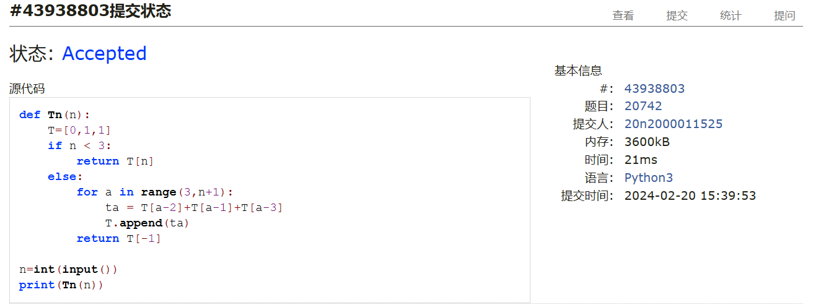
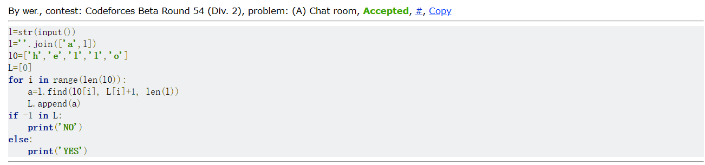
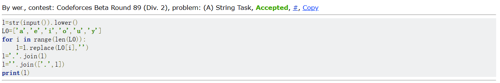
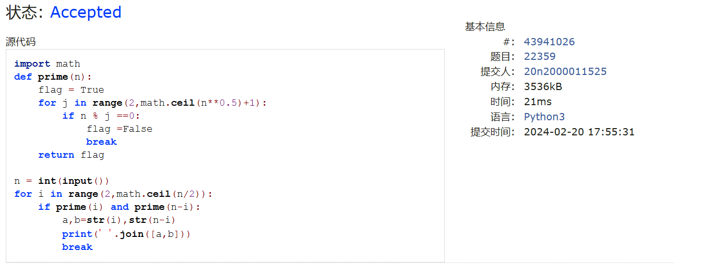
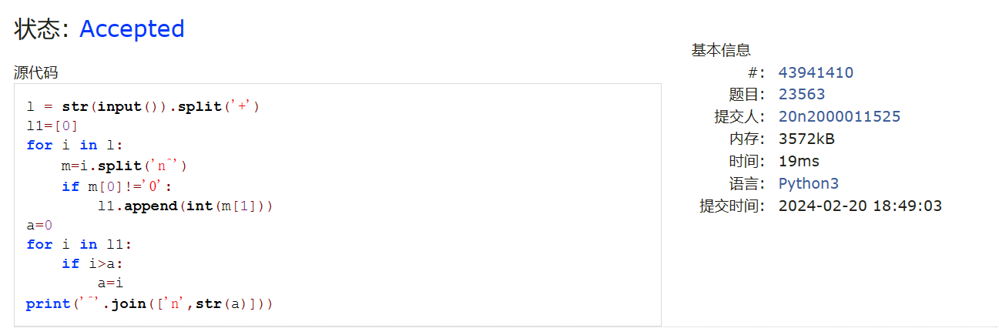
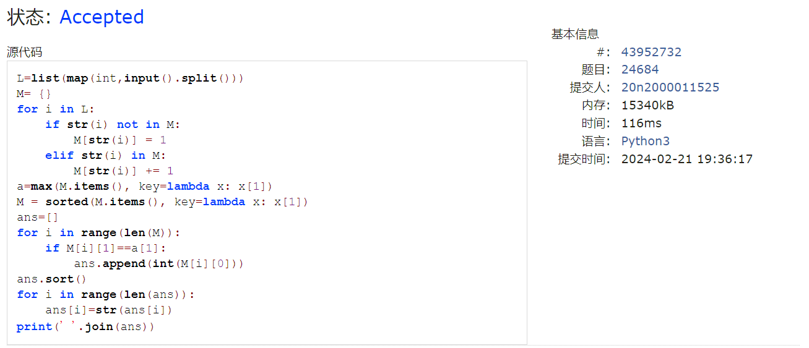

# Assignment #1: 拉齐大家Python水平

Updated 0940 GMT+8 Mar 9, 2024

2024 spring, Complied by ==何昱、物理学院==


**编程环境**

操作系统：版本	Windows 10 家庭中文版

Python编程环境：PyCharm 2022.2.1 (Professional Edition)


## 1. 题目

### 20742: 泰波拿契數

http://cs101.openjudge.cn/practice/20742/


思路：进行循环计算即可


##### 代码

```python
# 
def Tn(n):
    T=[0,1,1]
    if n < 3:
        return T[n]
    else:
        for a in range(3,n+1):
            ta = T[a-2]+T[a-1]+T[a-3]
            T.append(ta)
        return T[-1]

n=int(input())
print(Tn(n))
```


代码运行截图 ==（至少包含有"Accepted"）==



### 58A. Chat room

greedy/strings, 1000, http://codeforces.com/problemset/problem/58/A


思路：首先在字符串生成的列表前添加保护字符a，利用find函数，依次寻找'h','e','l','l','o'，寻找的范围为上一个字符的位置到列表末尾。找到将位置存入L，否则存入-1，最后根据L 中是否有-1来判断输出YES还是NO


##### 代码

```python
# 
l=str(input())
l=''.join(['a',l])
l0=['h','e','l','l','o']
L=[0]
for i in range(len(l0)):
    a=l.find(l0[i], L[i]+1, len(l))
    L.append(a)
if -1 in L:
    print('NO')
else:
    print('YES')
```


代码运行截图 ==（至少包含有"Accepted"）==



### 118A. String Task

implementation/strings, 1000, http://codeforces.com/problemset/problem/118/A


思路：先将字符串全部小写化，在生成列表，删除其中元音，最后用join连接


##### 代码

```python
# 
l=str(input()).lower()
L0=['a','e','i','o','u','y']
for i in range(len(L0)):
    l=l.replace(L0[i],'')
l='.'.join(l)
l=''.join(['.',l])
print(l)
```


代码运行截图 ==（AC代码截图，至少包含有"Accepted"）==



### 22359: Goldbach Conjecture

http://cs101.openjudge.cn/practice/22359/


思路：通过不断除法运算来判断某个数是否是素数，若i和n-i都是素数，进行输出


##### 代码

```python
# 
import math
def prime(n):
    flag = True
    for j in range(2,math.ceil(n**0.5)+1):
        if n % j ==0:
            flag =False
            break
    return flag

n = int(input())
for i in range(2,math.ceil(n/2)):
    if prime(i) and prime(n-i):
        a,b=str(i),str(n-i)
        print(' '.join([a,b]))
        break
```


代码运行截图 ==（AC代码截图，至少包含有"Accepted"）==



### 23563: 多项式时间复杂度

http://cs101.openjudge.cn/practice/23563/


思路：将字符串先按+分解，再按n^分解，得到各项的系数和指数，若系数不为零，存储指数，找到最大的指数即可


##### 代码

```python
# 
l = str(input()).split('+')
l1=[0]
for i in l:
    m=i.split('n^')
    if m[0]!='0':
        l1.append(int(m[1]))
a=0
for i in l1:
    if i>a:
        a=i
print('^'.join(['n',str(a)]))

```


代码运行截图 ==（AC代码截图，至少包含有"Accepted"）==



### 24684: 直播计票

http://cs101.openjudge.cn/practice/24684/


思路：字典，字典的key表示选项，value表示次数，找到字典中最大的value，遍历列表，获取value最大的key，对这些key进行排序最后输出


##### 代码

```python
# 
L=list(map(int,input().split()))
M= {}
for i in L:
    if str(i) not in M:
        M[str(i)] = 1
    elif str(i) in M:
        M[str(i)] += 1
a=max(M.items(), key=lambda x: x[1])
M = sorted(M.items(), key=lambda x: x[1])
ans=[]
for i in range(len(M)):
    if M[i][1]==a[1]:
        ans.append(int(M[i][0]))
ans.sort()
for i in range(len(ans)):
    ans[i]=str(ans[i])
print(' '.join(ans))


```


代码运行截图 ==（AC代码截图，至少包含有"Accepted"）==



## 2. 学习总结和收获
回忆了计算概论B的一些知识


