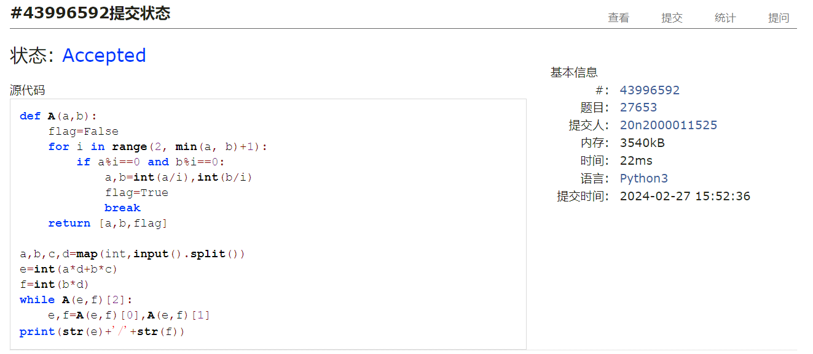
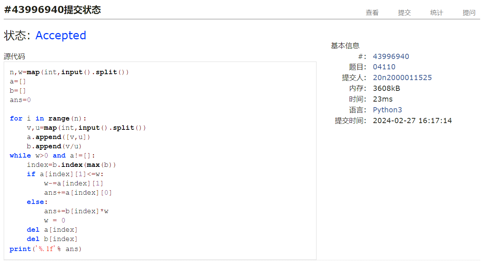
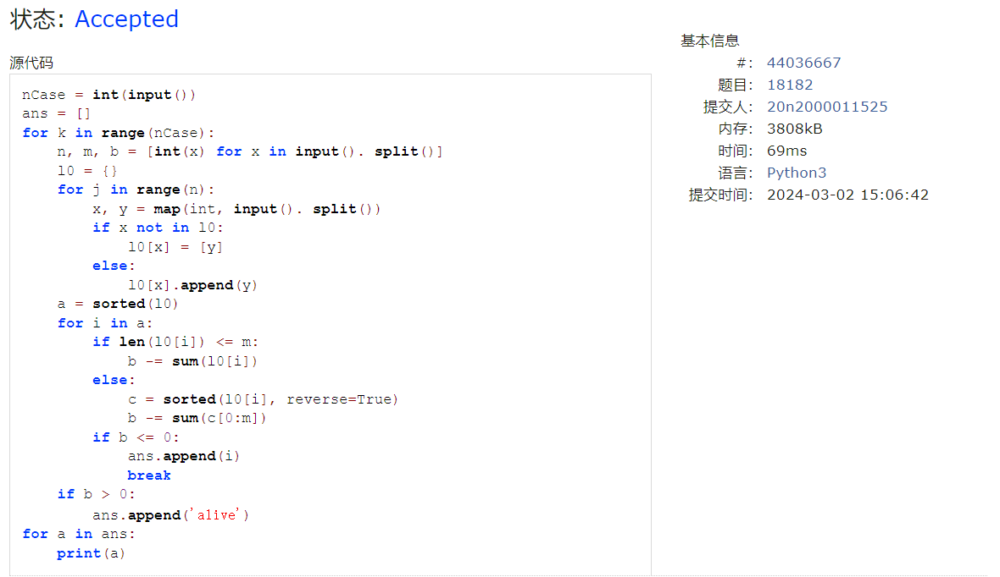
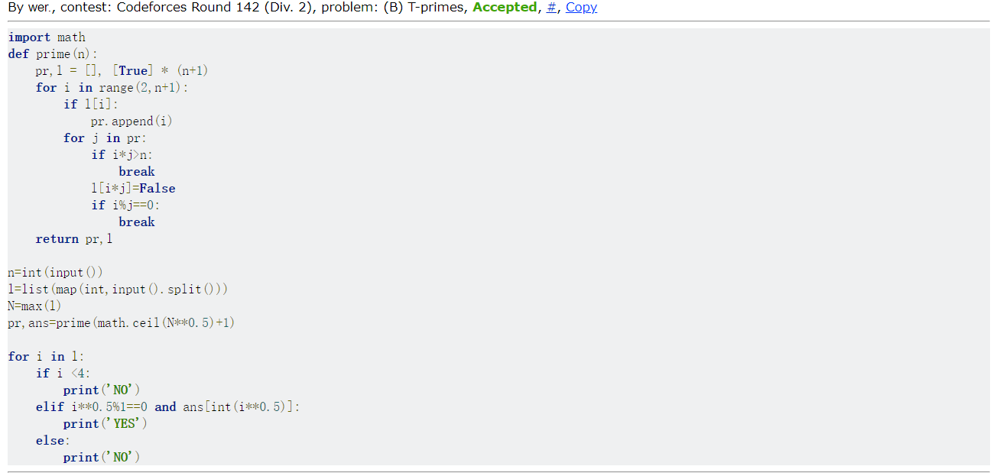
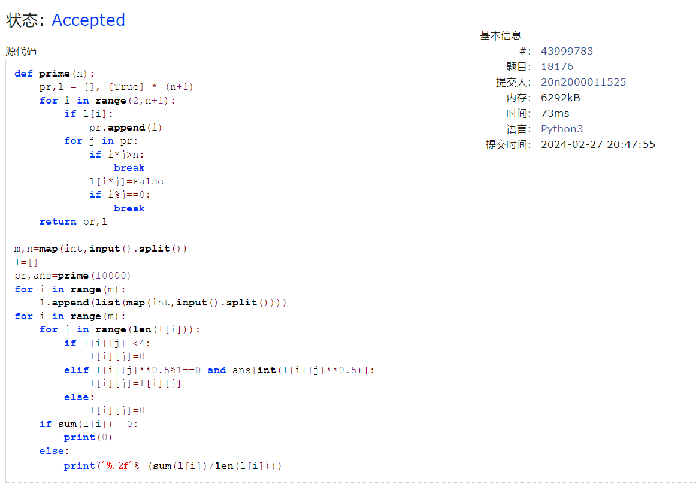

# Assignment #2: 编程练习

Updated 0940 GMT+8 Mar 9, 2024

2024 spring, Complied by ==何昱、物理学院==


**编程环境**

操作系统：版本	Windows 10 家庭中文版

Python编程环境：PyCharm 2022.2.1 (Professional Edition)


## 1. 题目

### 27653: Fraction类

http://cs101.openjudge.cn/2024sp_routine/27653/


思路：先合并后约分


##### 代码

```python
# 
def A(a,b):
    flag=False
    for i in range(2, min(a, b)+1):
        if a%i==0 and b%i==0:
            a,b=int(a/i),int(b/i)
            flag=True
            break
    return [a,b,flag]

a,b,c,d=map(int,input().split())
e=int(a*d+b*c)
f=int(b*d)
while A(e,f)[2]:
    e,f=A(e,f)[0],A(e,f)[1]
print(str(e)+'/'+str(f))
```


代码运行截图 ==（至少包含有"Accepted"）==



### 04110: 圣诞老人的礼物-Santa Clau’s Gifts

greedy/dp, http://cs101.openjudge.cn/practice/04110


思路：依次存储单位重量最大价值的物品


##### 代码

```python
# 
n,w=map(int,input().split())
a=[]
b=[]
ans=0

for i in range(n):
    v,u=map(int,input().split())
    a.append([v,u])
    b.append(v/u)
while w>0 and a!=[]:
    index=b.index(max(b))
    if a[index][1]<=w:
        w-=a[index][1]
        ans+=a[index][0]
    else:
        ans+=b[index]*w
        w = 0
    del a[index]
    del b[index]
print('%.1f'% ans)
```


代码运行截图 ==（至少包含有"Accepted"）==



### 18182: 打怪兽

implementation/sortings/data structures, http://cs101.openjudge.cn/practice/18182/


思路：字典，key为时间，value为对应时间能使用的技能的伤害，同一时间的伤害由大到小排序


##### 代码

```python
# 
nCase = int(input())
ans = []
for k in range(nCase):
    n, m, b = [int(x) for x in input(). split()]
    l0 = {}
    for j in range(n):
        x, y = map(int, input(). split())
        if x not in l0:
            l0[x] = [y]
        else:
            l0[x].append(y)
    a = sorted(l0)
    for i in a:
        if len(l0[i]) <= m:
            b -= sum(l0[i])
        else:
            c = sorted(l0[i], reverse=True)
            b -= sum(c[0:m])
        if b <= 0:
            ans.append(i)
            break
    if b > 0:
        ans.append('alive')
for a in ans:
    print(a)
```


代码运行截图 ==（AC代码截图，至少包含有"Accepted"）==



### 230B. T-primes

binary search/implementation/math/number theory, 1300, http://codeforces.com/problemset/problem/230/B


思路：按描述，T-prime的必然是某个素数的平方，用欧拉筛法获得范围内所有素数，判断给定数据是否是素数平方即可


##### 代码

```python
# 
import math
def prime(n):
    pr,l = [], [True] * (n+1)
    for i in range(2,n+1):
        if l[i]:
            pr.append(i)
        for j in pr:
            if i*j>n:
                break
            l[i*j]=False
            if i%j==0:
                break
    return pr,l

n=int(input())
l=list(map(int,input().split()))
N=max(l)
pr,ans=prime(math.ceil(N**0.5)+1)

for i in l:
    if i <4:
        print('NO')
    elif i**0.5%1==0 and ans[int(i**0.5)]:
        print('YES')
    else:
        print('NO')

```


代码运行截图 ==（AC代码截图，至少包含有"Accepted"）==



### 1364A. XXXXX

brute force/data structures/number theory/two pointers, 1200, https://codeforces.com/problemset/problem/1364/A


思路：


##### 代码

```python
# 

```


代码运行截图 ==（AC代码截图，至少包含有"Accepted"）==


### 18176: 2050年成绩计算

http://cs101.openjudge.cn/practice/18176/


思路：同230B，判断后取平均即可


##### 代码

```python
# 
def prime(n):
    pr,l = [], [True] * (n+1)
    for i in range(2,n+1):
        if l[i]:
            pr.append(i)
        for j in pr:
            if i*j>n:
                break
            l[i*j]=False
            if i%j==0:
                break
    return pr,l

m,n=map(int,input().split())
l=[]
pr,ans=prime(10000)
for i in range(m):
    l.append(list(map(int,input().split())))
for i in range(m):
    for j in range(len(l[i])):
        if l[i][j] <4:
            l[i][j]=0
        elif l[i][j]**0.5%1==0 and ans[int(l[i][j]**0.5)]:
            l[i][j]=l[i][j]
        else:
            l[i][j]=0
    if sum(l[i])==0:
        print(0)
    else:
        print('%.2f'% (sum(l[i])/len(l[i])))
```


代码运行截图 ==（AC代码截图，至少包含有"Accepted"）==



## 2. 学习总结和收获

T-prime由于超时花了较多时间，学习了欧拉筛的一些知识


