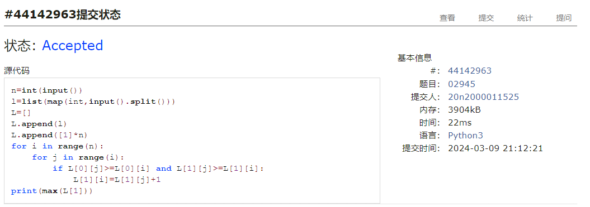
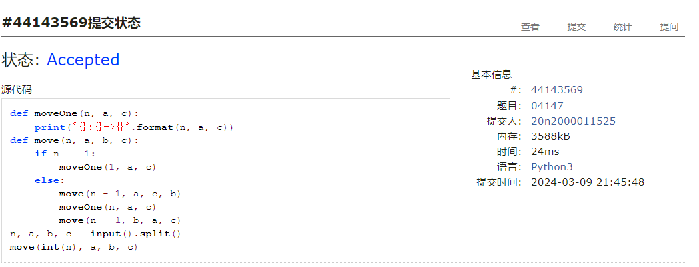
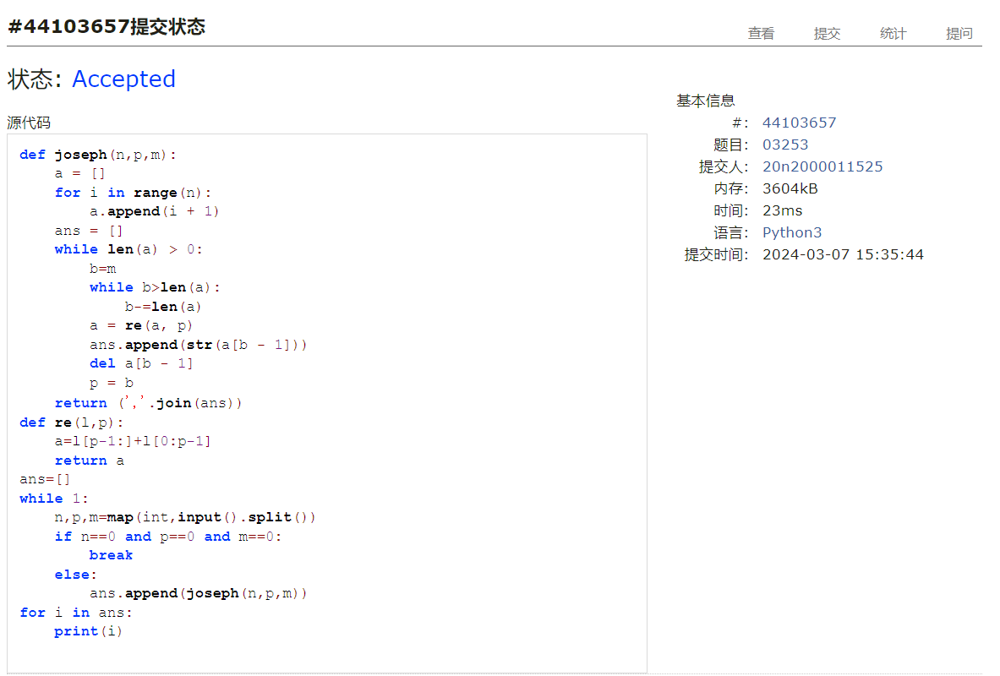
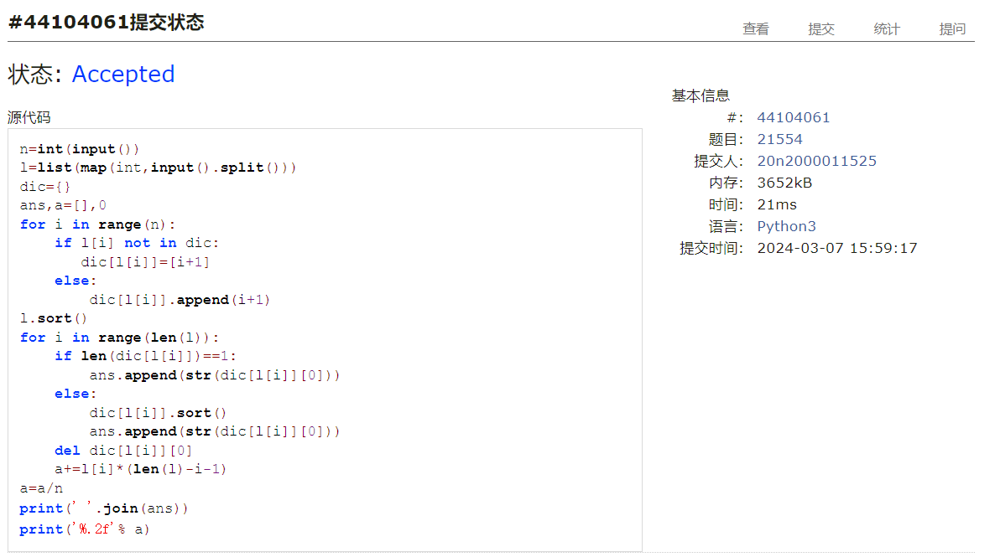
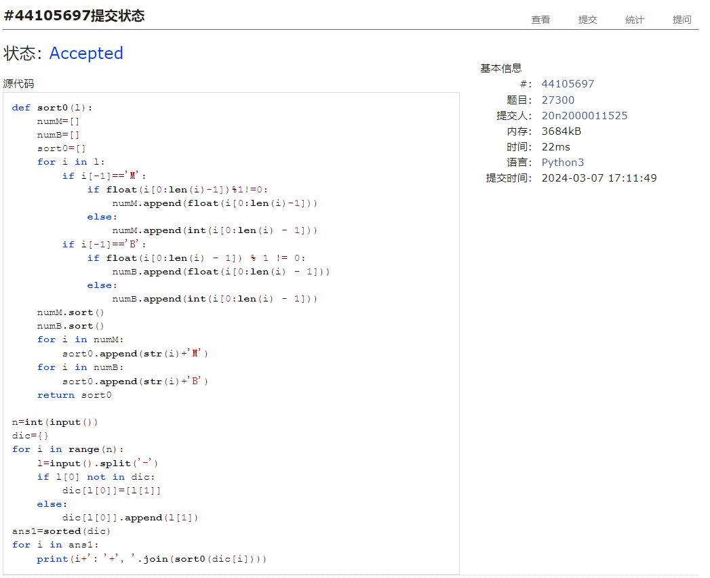

# Assignment #3: March月考

Updated 0940 GMT+8 Mar 9, 2024

2024 spring, Complied by ==何昱、物理学院==


**编程环境**

操作系统：版本	Windows 10 家庭中文版

Python编程环境：PyCharm 2022.2.1 (Professional Edition)


## 1. 题目

**02945: 拦截导弹**

http://cs101.openjudge.cn/practice/02945/


思路：给每个数字一个指标用于表征以该数字结尾的最长下降序列的长度，初始均为1.向后遍历列表，若前面的数大小比i大且指标也比i大，则更新i的指标.最后输出指标中最大的值


##### 代码

```python
# 
n=int(input())
l=list(map(int,input().split()))
L=[]
L.append(l)
L.append([1]*n)
for i in range(n):
    for j in range(i):
        if L[0][j]>=L[0][i] and L[1][j]>=L[1][i]:
            L[1][i]=L[1][j]+1
print(max(L[1]))
```


代码运行截图 ==（至少包含有"Accepted"）==



**04147:汉诺塔问题(Tower of Hanoi)**

http://cs101.openjudge.cn/practice/04147


思路：递归


##### 代码

```python
# 
def moveOne(n, a, c):
    print("{}:{}->{}".format(n, a, c))
def move(n, a, b, c):
    if n == 1:
        moveOne(1, a, c)
    else:
        move(n - 1, a, c, b)
        moveOne(n, a, c)
        move(n - 1, b, a, c)
n, a, b, c = input().split()
move(int(n), a, b, c)
```


代码运行截图 ==（至少包含有"Accepted"）==



**03253: 约瑟夫问题No.2**

http://cs101.openjudge.cn/practice/03253


思路：函数re用于重新构造列表，以下一个报1的数为开头雄性重新拼接列表。函数joseph循环删除报最后一个数的数，并将该数append到ans列表中


##### 代码

```python
# 
def joseph(n,p,m):
    a = []
    for i in range(n):
        a.append(i + 1)
    ans = []
    while len(a) > 0:
        b=m
        while b>len(a):
            b-=len(a)
        a = re(a, p)
        ans.append(str(a[b - 1]))
        del a[b - 1]
        p = b
    return (','.join(ans))
def re(l,p):
    a=l[p-1:]+l[0:p-1]
    return a
ans=[]
while 1:
    n,p,m=map(int,input().split())
    if n==0 and p==0 and m==0:
        break
    else:
        ans.append(joseph(n,p,m))
for i in ans:
    print(i)


```


代码运行截图 ==（AC代码截图，至少包含有"Accepted"）==



**21554:排队做实验 (greedy)v0.2**

http://cs101.openjudge.cn/practice/21554


思路：字典，key为时间长度，value为对应人的列表，实验按时间由短到长排序，人按先来后到排序


##### 代码

```python
# 
n=int(input())
l=list(map(int,input().split()))
dic={}
ans,a=[],0
for i in range(n):
    if l[i] not in dic:
       dic[l[i]]=[i+1]
    else:
        dic[l[i]].append(i+1)
l.sort()
for i in range(len(l)):
    if len(dic[l[i]])==1:
        ans.append(str(dic[l[i]][0]))
    else:
        dic[l[i]].sort()
        ans.append(str(dic[l[i]][0]))
    del dic[l[i]][0]
    a+=l[i]*(len(l)-i-1)
a=a/n
print(' '.join(ans))
print('%.2f'% a)
```


代码运行截图 ==（AC代码截图，至少包含有"Accepted"）==



**19963:买学区房**

http://cs101.openjudge.cn/practice/19963


思路：计算房子价格和性价比的中位数，比较即可


##### 代码

```python
# 
n=int(input())
s=[eval(x) for x in input().split()]
p=list(map(int,input().split()))
dic={}
sp=[]
ans=0
for i in range(n):
    dic[i]=[(s[i][0]+s[i][1])/p[i],p[i]]
    sp.append((s[i][0]+s[i][1])/p[i])
sp.sort()
p.sort()
#print(sp,p)
if n%2==0:
    a=(sp[int(n/2)-1]+sp[int(n/2)])/2
    b=(p[int(n/2)-1]+p[int(n/2)])/2
else:
    a=sp[int((n-1)/2)]
    b=p[int((n-1)/2)]
#print(a,b,dic)
for i in dic:
    if dic[i][0]>a and dic[i][1]<b:
        ans+=1
print(ans)
```


代码运行截图 ==（AC代码截图，至少包含有"Accepted"）==


**27300: 模型整理**

http://cs101.openjudge.cn/practice/27300


思路：字典，key为模型名称，value为参数量的列表，key按字母排序，参数量按照B和M分别排序再拼接


##### 代码

```python
# 
def sort0(l):
    numM=[]
    numB=[]
    sort0=[]
    for i in l:
        if i[-1]=='M':
            if float(i[0:len(i)-1])%1!=0:
                numM.append(float(i[0:len(i)-1]))
            else:
                numM.append(int(i[0:len(i) - 1]))
        if i[-1]=='B':
            if float(i[0:len(i) - 1]) % 1 != 0:
                numB.append(float(i[0:len(i) - 1]))
            else:
                numB.append(int(i[0:len(i) - 1]))
    numM.sort()
    numB.sort()
    for i in numM:
        sort0.append(str(i)+'M')
    for i in numB:
        sort0.append(str(i)+'B')
    return sort0

n=int(input())
dic={}
for i in range(n):
    l=input().split('-')
    if l[0] not in dic:
        dic[l[0]]=[l[1]]
    else:
        dic[l[0]].append(l[1])
ans1=sorted(dic)
for i in ans1:
    print(i+': '+', '.join(sort0(dic[i])))

```


代码运行截图 ==（AC代码截图，至少包含有"Accepted"）==



## 2. 学习总结和收获

这次题目只要有思路就能较快做出来，前面两道题想了很久，后面四题较简单，大四选课学生只希望及格


