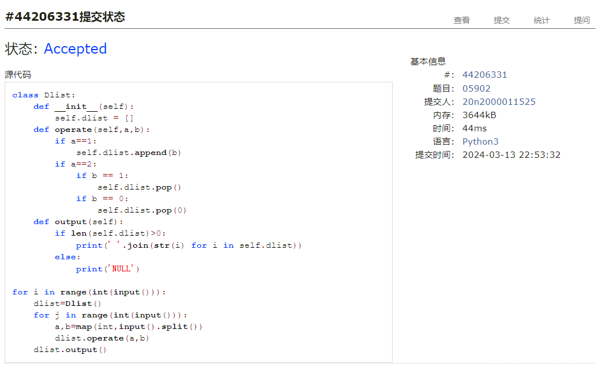
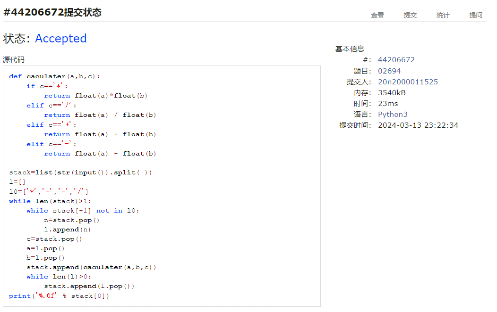
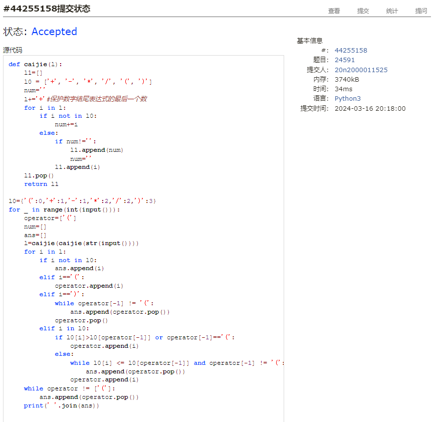
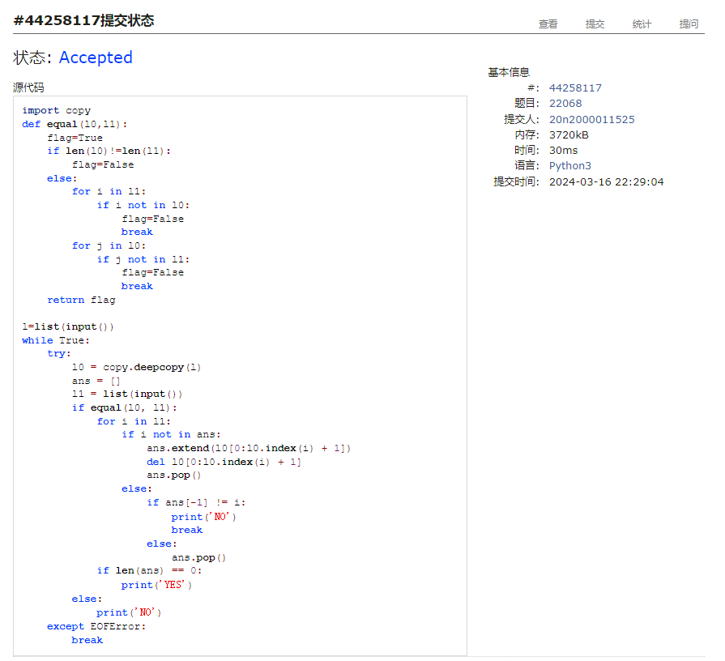
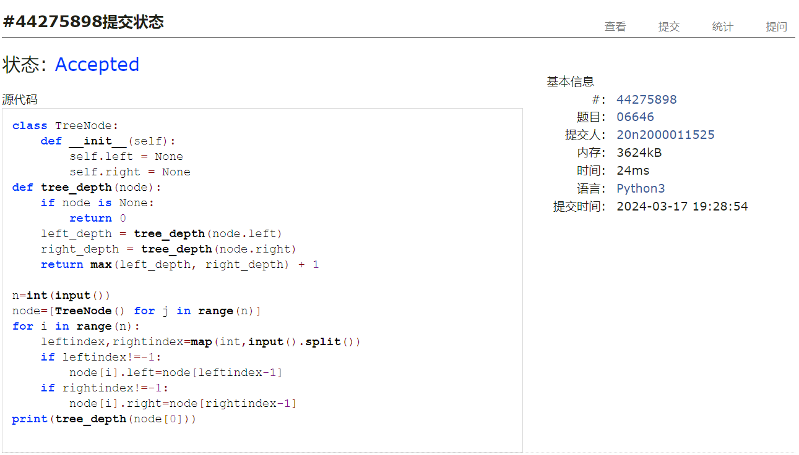

# Assignment #4: 排序、栈、队列和树

Updated 0005 GMT+8 March 17, 2024

2024 spring, Complied by ==何昱、物理学院==


**编程环境**

操作系统：版本	Windows 10 家庭中文版

Python编程环境：PyCharm 2022.2.1 (Professional Edition)


## 1. 题目

### 05902: 双端队列

http://cs101.openjudge.cn/practice/05902/


思路：定义class，根据题意定义操作和输出


代码

```python
# 
class Dlist:
    def __init__(self):
        self.dlist = []
    def operate(self,a,b):
        if a==1:
            self.dlist.append(b)
        if a==2:
            if b == 1:
                self.dlist.pop()
            if b == 0:
                self.dlist.pop(0)
    def output(self):
        if len(self.dlist)>0:
            print(' '.join(str(i) for i in self.dlist))
        else:
            print('NULL')

for i in range(int(input())):
    dlist=Dlist()
    for j in range(int(input())):
        a,b=map(int,input().split())
        dlist.operate(a,b)
    dlist.output()
```


代码运行截图 ==（至少包含有"Accepted"）==



### 02694: 波兰表达式

http://cs101.openjudge.cn/practice/02694/


思路：栈


代码

```python
# 
def caculater(a,b,c):
    if c=='*':
        return float(a)*float(b)
    elif c=='/':
        return float(a) / float(b)
    elif c=='+':
        return float(a) + float(b)
    elif c=='-':
        return float(a) - float(b)

stack=list(str(input()).split( ))
l=[]
l0=['*','+','-','/']
while len(stack)>1:
    while stack[-1] not in l0:
        n=stack.pop()
        l.append(n)
    c=stack.pop()
    a=l.pop()
    b=l.pop()
    stack.append(caculater(a,b,c))
    while len(l)>0:
        stack.append(l.pop())
print('%.6f' % stack[0])

```


代码运行截图 ==（至少包含有"Accepted"）==



### 24591: 中序表达式转后序表达式

http://cs101.openjudge.cn/practice/24591/


思路：先按符号将字符串分解为数字和运算符，再使用Shunting Yards算法


代码

```python
# 
def caijie(l):
    l1=[]
    l0 = ['+', '-', '*', '/', '(', ')']
    num=''
    l=l+'+'#保护数字结尾表达式的最后一个数
    for i in l:
        if i not in l0:
            num+=i
        else:
            if num!='':
                l1.append(num)
                num=''
            l1.append(i)
    l1.pop()
    return l1

l0={'(':0,'+':1,'-':1,'*':2,'/':2,')':3}
for _ in range(int(input())):
    operator=['(']
    num=[]
    ans=[]
    l=caijie(caijie(str(input())))
    for i in l:
        if i not in l0:
            ans.append(i)
        elif i=='(':
            operator.append(i)
        elif i==')':
            while operator[-1] != '(':
                ans.append(operator.pop())
            operator.pop()
        elif i in l0:
            if l0[i]>l0[operator[-1]] or operator[-1]=='(':
                operator.append(i)
            else:
                while l0[i] <= l0[operator[-1]] and operator[-1] != '(':
                    ans.append(operator.pop())
                operator.append(i)
    while operator != ['(']:
        ans.append(operator.pop())
    print(' '.join(ans))


```


代码运行截图 ==（AC代码截图，至少包含有"Accepted"）==



### 22068: 合法出栈序列

http://cs101.openjudge.cn/practice/22068/


思路：模拟出栈顺序。给定的序列，从头到尾遍历，每次判断该字符是否在模拟栈中，若在且不为最后一个，则NO；若不在，则将原字符串中该字符前面所有字符都加入栈，重复上述过程即可


代码

```python
# 
import copy
def equal(l0,l1):
    flag=True
    if len(l0)!=len(l1):
        flag=False
    else:
        for i in l1:
            if i not in l0:
                flag=False
                break
        for j in l0:
            if j not in l1:
                flag=False
                break
    return flag

l=list(input())
while True:
    try:
        l0 = copy.deepcopy(l)
        ans = []
        l1 = list(input())
        if equal(l0, l1):
            for i in l1:
                if i not in ans:
                    ans.extend(l0[0:l0.index(i) + 1])
                    del l0[0:l0.index(i) + 1]
                    ans.pop()
                else:
                    if ans[-1] != i:
                        print('NO')
                        break
                    else:
                        ans.pop()
            if len(ans) == 0:
                print('YES')
        else:
            print('NO')
    except EOFError:
        break
```


代码运行截图 ==（AC代码截图，至少包含有"Accepted"）==



### 06646: 二叉树的深度

http://cs101.openjudge.cn/practice/06646/


思路：递归，树深度为子树加一


代码

```python
# 
class TreeNode:
    def __init__(self):
        self.left = None
        self.right = None
def tree_depth(node):
    if node is None:
        return 0
    left_depth = tree_depth(node.left)
    right_depth = tree_depth(node.right)
    return max(left_depth, right_depth) + 1

n=int(input())
node=[TreeNode() for j in range(n)]
for i in range(n):
    leftindex,rightindex=map(int,input().split())
    if leftindex!=-1:
        node[i].left=node[leftindex-1]
    if rightindex!=-1:
        node[i].right=node[rightindex-1]
print(tree_depth(node[0]))


```


代码运行截图 ==（AC代码截图，至少包含有"Accepted"）==



### 02299: Ultra-QuickSort

http://cs101.openjudge.cn/practice/02299/


思路：


代码

```python
# 

```


代码运行截图 ==（AC代码截图，至少包含有"Accepted"）==


## 2. 学习总结和收获

学习了类的写法


