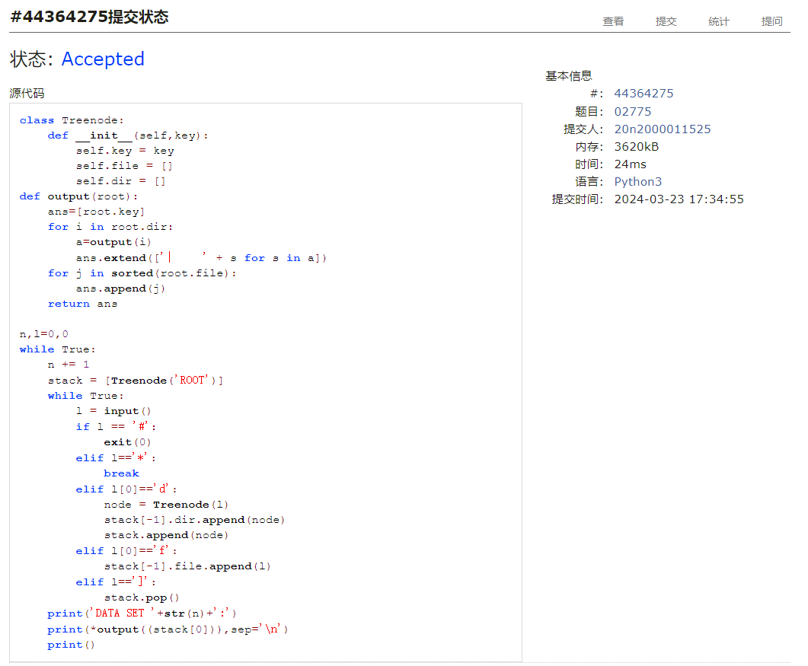

# Assignment #5: "树"算：概念、表示、解析、遍历
Updated 0005 GMT+8 March 23, 2024

2024 spring, Complied by ==何昱、物理学院==


**编程环境**

操作系统：版本	Windows 10 家庭中文版

Python编程环境：PyCharm 2022.2.1 (Professional Edition)


## 1. 题目

### 27638: 求二叉树的高度和叶子数目

http://cs101.openjudge.cn/practice/27638/


思路：树高度等于其左右子树高度的最大值加一，递归即可；叶子数目可以通过左右指标均为-1来判断


代码

```python
# 
class TreeNode:
    def __init__(self):
        self.left = None
        self.right = None
def tree_depth(node):
    if node is None:
        return 0
    left_depth = tree_depth(node.left)
    right_depth = tree_depth(node.right)
    return max(left_depth, right_depth) + 1

n=int(input())
node=[TreeNode() for j in range(n)]
parent=[False]*n
a=0
for i in range(n):
    leftindex,rightindex=map(int,input().split())
    if leftindex==-1 and rightindex==-1:
        a+=1
    if leftindex!=-1:
        node[i].left=node[leftindex]
        parent[leftindex]=True
    if rightindex!=-1:
        node[i].right=node[rightindex]
        parent[rightindex] = True
b=parent.index(False)
print(' '.join([str(tree_depth(node[b])-1),str(a)]))


```


代码运行截图 ==（至少包含有"Accepted"）==


### 24729: 括号嵌套树

http://cs101.openjudge.cn/practice/24729/


思路：利用栈建树


代码

```python
# 
class Treenode:
    def __init__(self,key):
        self.key = key
        self.children = []
def preorder(root):
    ans=[root.key]
    for child in root.children:
        ans.extend(preorder(child))
    return ''.join(ans)
def postorder(root):
    ans=[]
    for child in root.children:
        ans.extend(postorder(child))
    ans.append(root.key)
    return ''.join(ans)

Node=[]
root,node=None,None
for i in str(input()):
    if i.isalpha():
        node=Treenode(i)
        if Node:
            Node[-1].children.append(node)
    elif i=='(':
        Node.append(node)
    elif i==')':
        node=Node.pop()
print(preorder(node))
print(postorder(node))
```


代码运行截图 ==（至少包含有"Accepted"）==


### 02775: 文件结构“图”

http://cs101.openjudge.cn/practice/02775/


思路：利用栈建树，文件和文件夹分别存放，每次遇到括号返回上一个节点


代码

```python
# 
class Treenode:
    def __init__(self,key):
        self.key = key
        self.file = []
        self.dir = []
def output(root):
    ans=[root.key]
    for i in root.dir:
        a=output(i)
        ans.extend(['|     ' + s for s in a])
    for j in sorted(root.file):
        ans.append(j)
    return ans

n,l=0,0
while True:
    n += 1
    stack = [Treenode('ROOT')]
    while True:
        l = input()
        if l == '#':
            exit(0)
        elif l=='*':
            break
        elif l[0]=='d':
            node = Treenode(l)
            stack[-1].dir.append(node)
            stack.append(node)
        elif l[0]=='f':
            stack[-1].file.append(l)
        elif l==']':
            stack.pop()
    print('DATA SET '+str(n)+':')
    print(*output((stack[0])),sep='\n')
    print()
#while True: 用这个循环，样例的输出结果一模一样，为什么会WA
#   if l=='#':
#       break
#   n += 1
#   stack = [Treenode('ROOT')]
#   while True:
#       l = input()
#       if l=='*' or l=='#':
#           break
```


代码运行截图 ==（AC代码截图，至少包含有"Accepted"）==



### 25140: 根据后序表达式建立队列表达式

http://cs101.openjudge.cn/practice/25140/


思路：栈，遇到运算符，获取前两个数字，并把结果（用该运算符表示）放入数字栈中


代码

```python
# 
class TreeNode:
    def __init__(self,key):
        self.key=key
        self.left = None
        self.right = None
def translate(l):
    stack=[]
    for i in range(len(l)):
        if l[i].isupper():
            node = TreeNode(l[i])
            node.right=stack.pop()
            node.left=stack.pop()
            stack.append(node)
        elif l[i].islower():
            node = TreeNode(l[i])
            stack.append(node)
    return stack[-1]
def output(root):
    queue=[root]
    ans=[]
    while queue!=[]:
        ans.append(queue[0].key)
        if queue[0].left!=None:
            queue.append((queue[0].left))
        if queue[0].right!=None:
            queue.append((queue[0].right))
        queue.pop(0)
    return ans

for _ in range(int(input())):
    l=input()
    ans=(''.join(output(translate(l))))
    print(ans[::-1])
```


代码运行截图 ==（AC代码截图，至少包含有"Accepted"）==


### 24750: 根据二叉树中后序序列建树

http://cs101.openjudge.cn/practice/24750/


思路：后序序列最后一位一定是根，用该根切分中序表达式获得中序表达下的左子树和右子树，在利用中序表达下的子树切片获得后序表达下的子树，中序左子树和右子树分别与后序左子树和右子树形成新的中后序列，进行递归


代码

```python
# 
class TreeNode:
    def __init__(self,key):
        self.key=key
        self.left = None
        self.right = None
def buildtree(inorder,postorder):
    if not postorder:
        return None
    root=postorder[-1]
    node=TreeNode(root)
    inorderleft=inorder[:inorder.index(root)]
    inorderright=inorder[inorder.index(root)+1:]
    postorderleft=postorder[:inorder.index(root)]
    postorderright=postorder[inorder.index(root):len(postorder)-1]
    node.left=buildtree(inorderleft,postorderleft)
    node.right=buildtree(inorderright,postorderright)
    #print(node.key,node.left, node.right)
    return node
def preorder(root):
    ans=[]
    if root:
        ans=[root.key]
        ans.extend(preorder(root.left))
        ans.extend(preorder(root.right))
    return ''.join(ans)
inorder=input()
postoder=input()
root=buildtree(inorder,postoder)
print(preorder(root))

```


代码运行截图 ==（AC代码截图，至少包含有"Accepted"）==


### 22158: 根据二叉树前中序序列建树

http://cs101.openjudge.cn/practice/22158/


思路：类似24750: 根据二叉树中后序序列建树；


代码

```python
# 
class TreeNode:
    def __init__(self,key):
        self.key=key
        self.left = None
        self.right = None
def buildtree(inorder,preorder):
    if not preorder or not inorder:
        return None
    root=preorder[0]
    node=TreeNode(root)
    inorderleft=inorder[:inorder.index(root)]
    inorderright=inorder[inorder.index(root)+1:]
    preorderleft = preorder[1:inorder.index(root)+1]
    preorderright = preorder[inorder.index(root)+1:]
    node.left=buildtree(inorderleft,preorderleft)
    node.right=buildtree(inorderright,preorderright)
    #print(node.key,node.left, node.right)
    return node
def postorder(root):
    ans=[]
    if root:
        ans.extend(postorder(root.left))
        ans.extend(postorder(root.right))
        ans.append(root.key)
    return ''.join(ans)
while True:
    try:
        preorder = input()
        inorder = input()
        root = buildtree(inorder, preorder)
        print(postorder(root))
    except EOFError:
        break

```


代码运行截图 ==（AC代码截图，至少包含有"Accepted"）==


## 2. 学习总结和收获

通过栈建树的过程十分类似，但是递归思想较难写明白。


