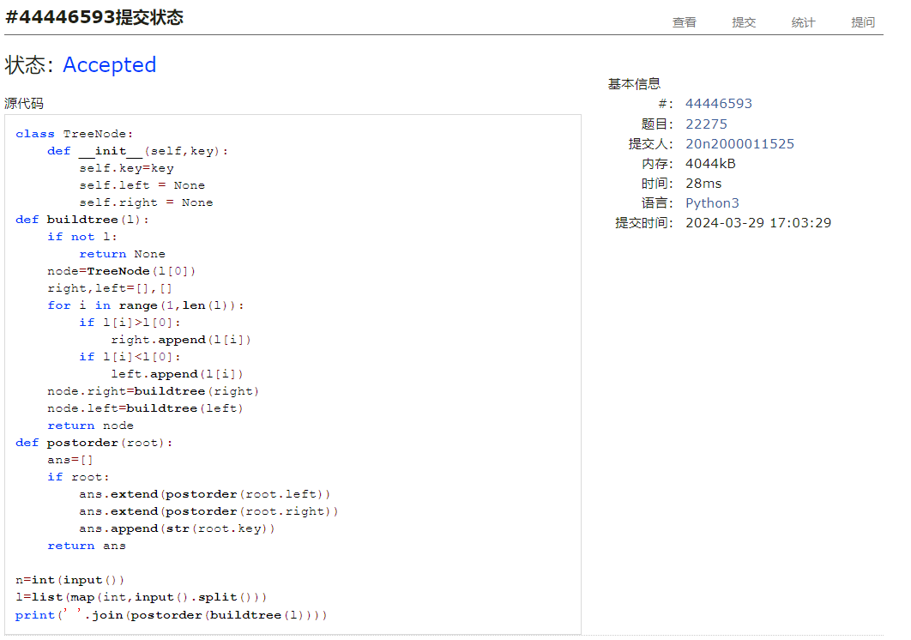
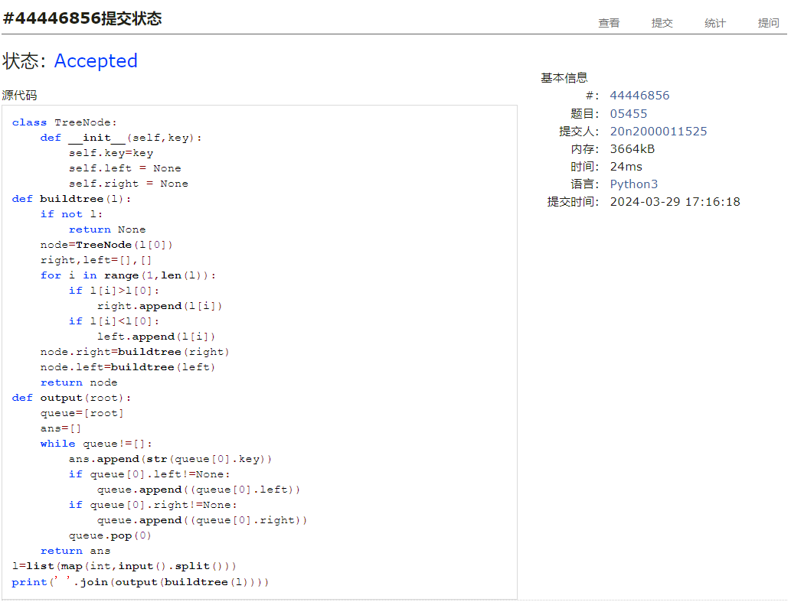
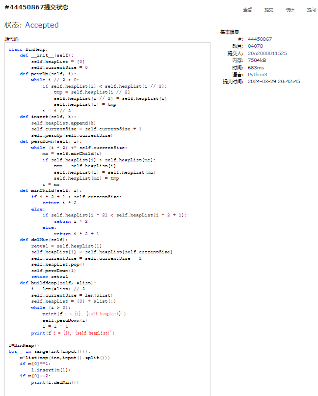
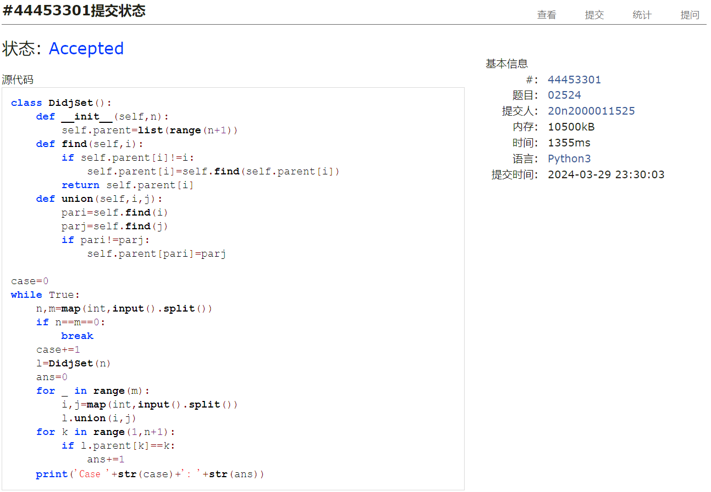

# Assignment #6: "树"算：Huffman,BinHeap,BST,AVL,DisjointSet

Updated 0000 GMT+8 March 3, 31, 2024

2024 spring, Complied by ==何昱、物理学院==


**编程环境**

操作系统：版本	Windows 10 家庭中文版

Python编程环境：PyCharm 2022.2.1 (Professional Edition)


## 1. 题目

### 22275: 二叉搜索树的遍历

http://cs101.openjudge.cn/practice/22275/


思路：根据定义，将后面比根大的数字和比根小的数字放到右子树和和左子树里，两个子树分别递归即可


代码

```python
# 
class TreeNode:
    def __init__(self,key):
        self.key=key
        self.left = None
        self.right = None
def buildtree(l):
    if not l:
        return None
    node=TreeNode(l[0])
    right,left=[],[]
    for i in range(1,len(l)):
        if l[i]>l[0]:
            right.append(l[i])
        if l[i]<l[0]:
            left.append(l[i])
    node.right=buildtree(right)
    node.left=buildtree(left)
    return node
def postorder(root):
    ans=[]
    if root:
        ans.extend(postorder(root.left))
        ans.extend(postorder(root.right))
        ans.append(str(root.key))
    return ans

n=int(input())
l=list(map(int,input().split()))
print(' '.join(postorder(buildtree(l))))
```


代码运行截图 ==（至少包含有"Accepted"）==



### 05455: 二叉搜索树的层次遍历

http://cs101.openjudge.cn/practice/05455/


思路：同第一题


代码

```python
# 
class TreeNode:
    def __init__(self,key):
        self.key=key
        self.left = None
        self.right = None
def buildtree(l):
    if not l:
        return None
    node=TreeNode(l[0])
    right,left=[],[]
    for i in range(1,len(l)):
        if l[i]>l[0]:
            right.append(l[i])
        if l[i]<l[0]:
            left.append(l[i])
    node.right=buildtree(right)
    node.left=buildtree(left)
    return node
def output(root):
    queue=[root]
    ans=[]
    while queue!=[]:
        ans.append(str(queue[0].key))
        if queue[0].left!=None:
            queue.append((queue[0].left))
        if queue[0].right!=None:
            queue.append((queue[0].right))
        queue.pop(0)
    return ans
l=list(map(int,input().split()))
print(' '.join(output(buildtree(l))))
```


代码运行截图 ==（至少包含有"Accepted"）==



### 04078: 实现堆结构

http://cs101.openjudge.cn/practice/04078/

练习自己写个BinHeap。当然机考时候，如果遇到这样题目，直接import heapq。手搓栈、队列、堆、AVL等，考试前需要搓个遍。


思路：


代码

```python
# 
class BinHeap:
    def __init__(self):
        self.heapList = [0]
        self.currentSize = 0

    def percUp(self, i):
        while i // 2 > 0:
            if self.heapList[i] < self.heapList[i // 2]:
                tmp = self.heapList[i // 2]
                self.heapList[i // 2] = self.heapList[i]
                self.heapList[i] = tmp
            i = i // 2

    def insert(self, k):
        self.heapList.append(k)
        self.currentSize = self.currentSize + 1
        self.percUp(self.currentSize)

    def percDown(self, i):
        while (i * 2) <= self.currentSize:
            mc = self.minChild(i)
            if self.heapList[i] > self.heapList[mc]:
                tmp = self.heapList[i]
                self.heapList[i] = self.heapList[mc]
                self.heapList[mc] = tmp
            i = mc

    def minChild(self, i):
        if i * 2 + 1 > self.currentSize:
            return i * 2
        else:
            if self.heapList[i * 2] < self.heapList[i * 2 + 1]:
                return i * 2
            else:
                return i * 2 + 1

    def delMin(self):
        retval = self.heapList[1]
        self.heapList[1] = self.heapList[self.currentSize]
        self.currentSize = self.currentSize - 1
        self.heapList.pop()
        self.percDown(1)
        return retval

    def buildHeap(self, alist):
        i = len(alist) // 2
        self.currentSize = len(alist)
        self.heapList = [0] + alist[:]
        while (i > 0):
            print(f'i = {i}, {self.heapList}')
            self.percDown(i)
            i = i - 1
        print(f'i = {i}, {self.heapList}')


l = BinHeap()
for _ in range(int(input())):
    m = list(map(int, input().split()))
    if m[0] == 1:
        l.insert(m[1])
    if m[0] == 2:
        print(l.delMin())
```


代码运行截图 ==（AC代码截图，至少包含有"Accepted"）==



### 22161: 哈夫曼编码树

http://cs101.openjudge.cn/practice/22161/


思路：


代码

```python
# 

```


代码运行截图 ==（AC代码截图，至少包含有"Accepted"）==


### 晴问9.5: 平衡二叉树的建立

https://sunnywhy.com/sfbj/9/5/359


思路：


代码

```python
# 

```


代码运行截图 ==（AC代码截图，至少包含有"Accepted"）==


### 02524: 宗教信仰

http://cs101.openjudge.cn/practice/02524/


思路：并查集


代码

```python
# 
class DidjSet():
    def __init__(self,n):
        self.parent=list(range(n+1))
    def find(self,i):
        if self.parent[i]!=i:
            self.parent[i]=self.find(self.parent[i])
        return self.parent[i]
    def union(self,i,j):
        pari=self.find(i)
        parj=self.find(j)
        if pari!=parj:
            self.parent[pari]=parj

case=0
while True:
    n,m=map(int,input().split())
    if n==m==0:
        break
    case+=1
    l=DidjSet(n)
    ans=0
    for _ in range(m):
        i,j=map(int,input().split())
        l.union(i,j)
    for k in range(1,n+1):
        if l.parent[k]==k:
            ans+=1
    print('Case '+str(case)+': '+str(ans))
```


代码运行截图 ==（AC代码截图，至少包含有"Accepted"）==



## 2. 学习总结和收获

感冒身体不适，只做了四题


