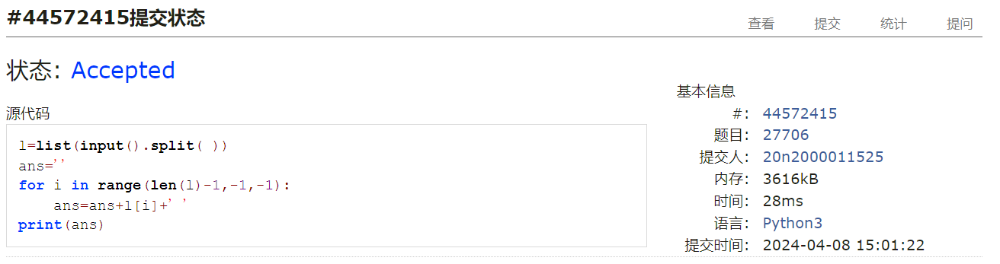
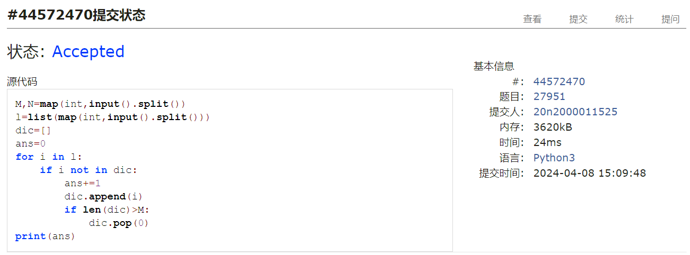
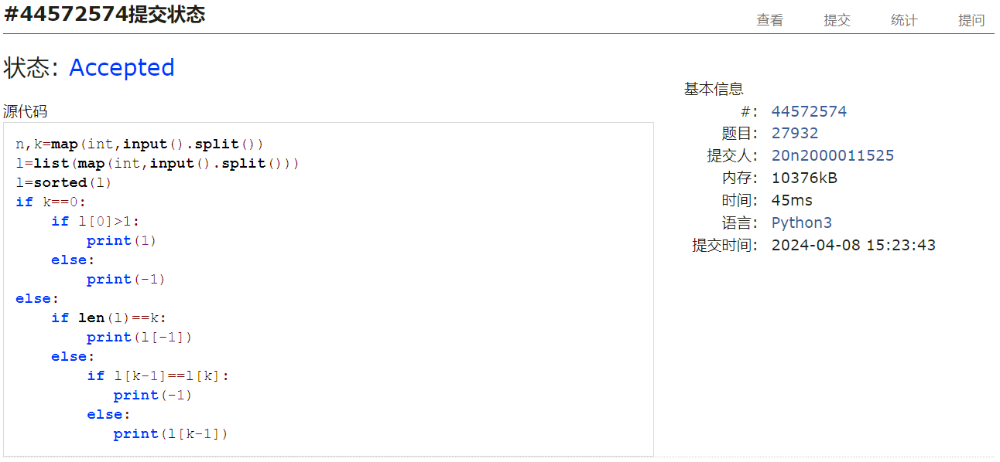
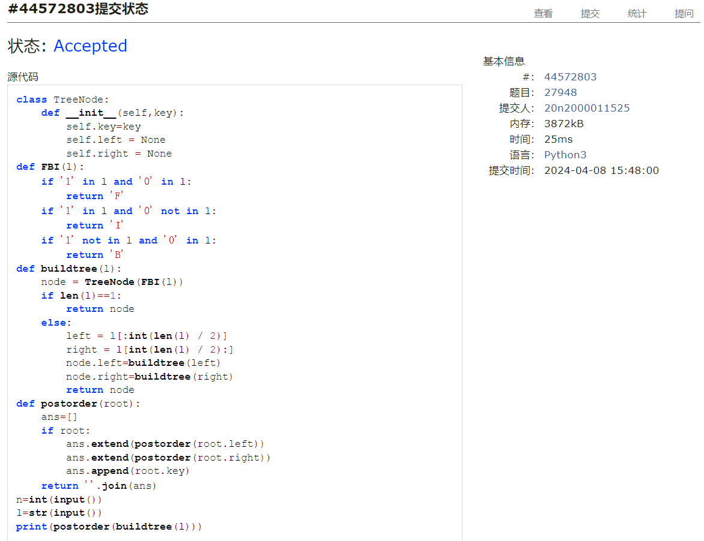
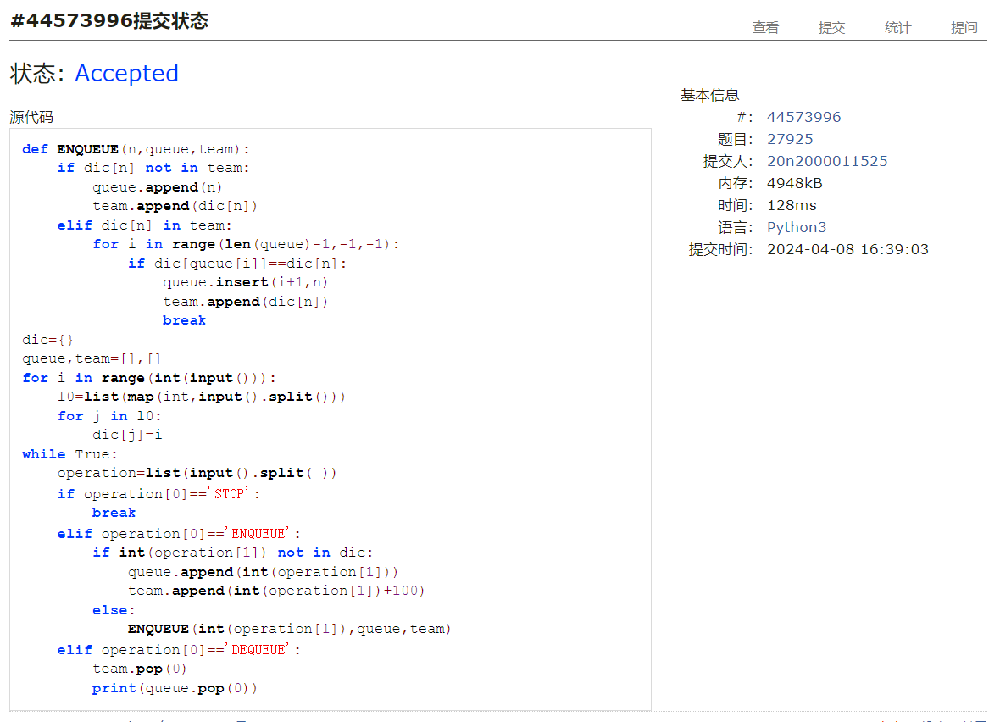
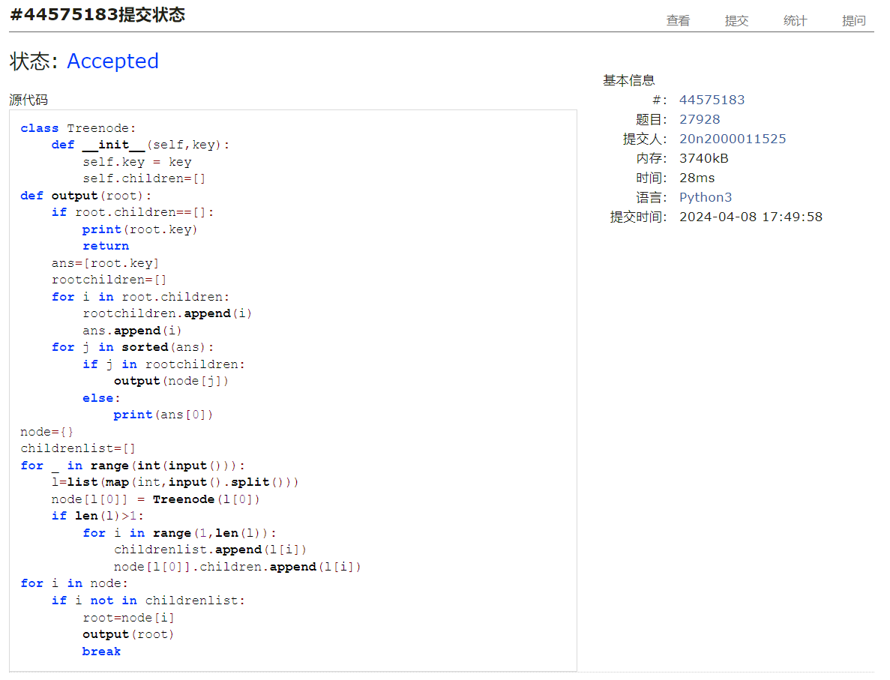

# Assignment #7: April 月考

Updated 0000 GMT+8 April, 8, 2024

2024 spring, Complied by ==何昱、物理学院==


**编程环境**

操作系统：版本	Windows 10 家庭中文版

Python编程环境：PyCharm 2022.2.1 (Professional Edition)


## 1. 题目

### 27706: 逐词倒放

http://cs101.openjudge.cn/practice/27706/


思路：倒序输出


代码

```python
# 
l=list(input().split( ))
ans=''
for i in range(len(l)-1,-1,-1):
    ans=ans+l[i]+' '
print(ans)
```


代码运行截图 ==（至少包含有"Accepted"）==



### 27951: 机器翻译

http://cs101.openjudge.cn/practice/27951/


思路：建字典，不断增删即可


代码

```python
# 
M,N=map(int,input().split())
l=list(map(int,input().split()))
dic=[]
ans=0
for i in l:
    if i not in dic:
        ans+=1
        dic.append(i)
        if len(dic)>M:
            dic.pop(0)
print(ans)

```


代码运行截图 ==（至少包含有"Accepted"）==



### 27932: Less or Equal

http://cs101.openjudge.cn/practice/27932/


思路：比较大小，注意考虑k=0的情况


代码

```python
# 
n,k=map(int,input().split())
l=list(map(int,input().split()))
l=sorted(l)
if k==0:
    if l[0]>1:
        print(1)
    else:
        print(-1)
else:
    if len(l)==k:
        print(l[-1])
    else:
        if l[k-1]==l[k]:
           print(-1)
        else:
           print(l[k-1])
```


代码运行截图 ==（AC代码截图，至少包含有"Accepted"）==



### 27948: FBI树

http://cs101.openjudge.cn/practice/27948/


思路：递归建树，后序输出


代码

```python
# 
class TreeNode:
    def __init__(self,key):
        self.key=key
        self.left = None
        self.right = None
def FBI(l):
    if '1' in l and '0' in l:
        return 'F'
    if '1' in l and '0' not in l:
        return 'I'
    if '1' not in l and '0' in l:
        return 'B'
def buildtree(l):
    node = TreeNode(FBI(l))
    if len(l)==1:
        return node
    else:
        left = l[:int(len(l) / 2)]
        right = l[int(len(l) / 2):]
        node.left=buildtree(left)
        node.right=buildtree(right)
        return node
def postorder(root):
    ans=[]
    if root:
        ans.extend(postorder(root.left))
        ans.extend(postorder(root.right))
        ans.append(root.key)
    return ''.join(ans)
n=int(input())
l=str(input())
print(postorder(buildtree(l)))


```


代码运行截图 ==（AC代码截图，至少包含有"Accepted"）==



### 27925: 小组队列

http://cs101.openjudge.cn/practice/27925/


思路：字典key值为人，value值为小组。建双列表，queue用于储存人，team在对应位置存小组。注意考虑没有组的人排队


代码

```python
# 
def ENQUEUE(n,queue,team):
    if dic[n] not in team:
        queue.append(n)
        team.append(dic[n])
    elif dic[n] in team:
        for i in range(len(queue)-1,-1,-1):
            if dic[queue[i]]==dic[n]:
                queue.insert(i+1,n)
                team.append(dic[n])
                break
dic={}
queue,team=[],[]
for i in range(int(input())):
    l0=list(map(int,input().split()))
    for j in l0:
        dic[j]=i
while True:
    operation=list(input().split( ))
    if operation[0]=='STOP':
        break
    elif operation[0]=='ENQUEUE':
        if int(operation[1]) not in dic:
            queue.append(int(operation[1]))
            team.append(int(operation[1])+100)
        else:
            ENQUEUE(int(operation[1]),queue,team)
    elif operation[0]=='DEQUEUE':
        team.pop(0)
        print(queue.pop(0))
```


代码运行截图 ==（AC代码截图，至少包含有"Accepted"）==



### 27928: 遍历树

http://cs101.openjudge.cn/practice/27928/


思路：字典树


代码

```python
# 
class Treenode:
    def __init__(self,key):
        self.key = key
        self.children=[]
def output(root):
    if root.children==[]:
        print(root.key)
        return
    ans=[root.key]
    rootchildren=[]
    for i in root.children:
        rootchildren.append(i)
        ans.append(i)
    for j in sorted(ans):
        if j in rootchildren:
            output(node[j])
        else:
            print(ans[0])
node={}
childrenlist=[]
for _ in range(int(input())):
    l=list(map(int,input().split()))
    node[l[0]] = Treenode(l[0])
    if len(l)>1:
        for i in range(1,len(l)):
            childrenlist.append(l[i])
            node[l[0]].children.append(l[i])
for i in node:
    if i not in childrenlist:
        root=node[i]
        output(root)
        break

```


代码运行截图 ==（AC代码截图，至少包含有"Accepted"）==



## 2. 学习总结和收获

前五题较为简单，考虑各种情况即可。最后一题需要字典树来索引node


