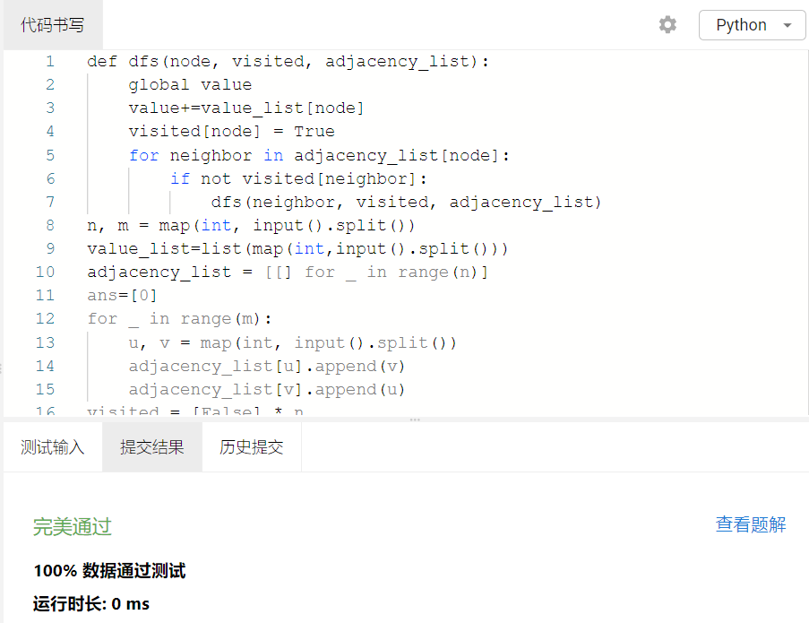

# Assignment #8: 图论：概念、遍历，及 树算

Updated 0000 GMT+8 April, 14, 2024

2024 spring, Complied by ==何昱、物理学院==


**编程环境**

操作系统：版本	Windows 10 家庭中文版

Python编程环境：PyCharm 2022.2.1 (Professional Edition)


## 1. 题目

### 19943: 图的拉普拉斯矩阵

matrices, http://cs101.openjudge.cn/practice/19943/


思路：D是对角矩阵，A则没有对角元，直接建矩阵L，根据输入修改里面的元素即可


代码

```python
# 
n,m=map(int,input().split())
L=[[0]*n for j in range(n)]
for _ in range(m):
    i,j=map(int,input().split())
    L[i][i]+=1
    L[j][j]+=1
    L[i][j]=L[j][i]=-1
for i in range(n):
    print(' '.join(str(k) for k in L[i]))
```


代码运行截图 ==（至少包含有"Accepted"）==


### 18160: 最大连通域面积

matrix/dfs similar, http://cs101.openjudge.cn/practice/18160


思路：深度优先搜索，建立矩阵存储w和.，并加保护套。遍历共有八个方向，选取其中是w的方向递归


代码

```python
# 
area=0
operation=[[-1,-1],[-1,0],[-1,1],[0,-1],[0,1],[1,-1],[1,0],[1,1]]
def dfs(l,i,j):
    global area
    area+=1
    l[i][j]='.'
    for k in range(len(operation)):
        if l[i+operation[k][0]][j+operation[k][1]]=='W':
            dfs(l,i+operation[k][0],j+operation[k][1])
    return area

for _ in range(int(input())):
    n,m=map(int,input().split())
    l=[['.']*(m+2)]
    ans=[0]
    for i in range(1,n+1):
        l1=['.']
        l1.extend(input())
        l1.append('.')
        l.append(l1)
    l.append(['.']*(m+2))#矩阵构建完成
    for j in range(1,n+1):
        for k in range(1,m+1):
            if l[j][k]=='W':
                area=0
                ans.append(dfs(l,j,k))
    print(max(ans))
```


代码运行截图 ==（至少包含有"Accepted"）==


### sy383: 最大权值连通块

https://sunnywhy.com/sfbj/10/3/383


思路：
通过深度优先搜索找到其中的连通块，每个连通块的权重加和取最大即可


代码

```python
# 
def dfs(node, visited, adjacency_list):
    global value
    value+=value_list[node]
    visited[node] = True
    for neighbor in adjacency_list[node]:
        if not visited[neighbor]:
            dfs(neighbor, visited, adjacency_list)
n, m = map(int, input().split())
value_list=list(map(int,input().split()))
adjacency_list = [[] for _ in range(n)]
ans=[0]
for _ in range(m):
    u, v = map(int, input().split())
    adjacency_list[u].append(v)
    adjacency_list[v].append(u)
visited = [False] * n
connected_components = 0
for i in range(n):
    if not visited[i]:
        value=0
        dfs(i, visited, adjacency_list)
        ans.append(value)
print(max(ans))

```


代码运行截图 ==（AC代码截图，至少包含有"Accepted"）==



### 03441: 4 Values whose Sum is 0

data structure/binary search, http://cs101.openjudge.cn/practice/03441


思路：先算出A,B中元素加和的所有情况，存到字典中，字典的key是加和，value是该加和的组合种数。接着计算C,D中元素的加和的相反数，若在字典中，则结果总数加value


代码

```python
# 
l1=[]
dic={}
ans=0
n=int(input())
for _ in range(n):
    l1.append(list(map(int,input().split())))
for i in range(n):
    for j in range(n):
        a=l1[i][0]+l1[j][1]
        if a not in dic:
            dic[a]=1
        else:
            dic[a]+=1
for k in range(n):
    for l in range(n):
        b=-l1[k][2]-l1[l][3]
        if b in dic:
            ans+=dic[b]
print(ans)
```


代码运行截图 ==（AC代码截图，至少包含有"Accepted"）==


### 04089: 电话号码

trie, http://cs101.openjudge.cn/practice/04089/


思路：


代码

```python
# 

```


代码运行截图 ==（AC代码截图，至少包含有"Accepted"）==


### 04082: 树的镜面映射

http://cs101.openjudge.cn/practice/04082/


思路：括号嵌套树，遍历输入，向stack压入第一位，若第二位是0，则压入'('，第二位是1，压入')'。即可将伪满二叉树还原成普通的树。然后分层次遍历，每层reversed后输出


代码

```python
# 
n=int(input())
l=list(input().split())
stack=[]
for i in l:
    if i[1] == '0':
        stack.append(i[0])
        stack.append('(')
    if i[1] == '1':
        stack.append(i[0])
        stack.append(')')
level,dic=0,{}
for j in stack:
    if j=='(':
        level+=1
    elif j==')':
        level-=1
    else:
        if j!='$':
            if level not in dic:
                dic[level]=[j]
            else:
                dic[level].append(j)
a,ans=0,[]
while a in dic:
    ans.extend(reversed(dic[a]))
    a+=1
print(' '.join(ans))
```


代码运行截图 ==（AC代码截图，至少包含有"Accepted"）==


## 2. 学习总结和收获

深度优先搜索比较容易理解。最后一题在草稿纸上画了很久，发现用括号嵌套树可以直接还原。


