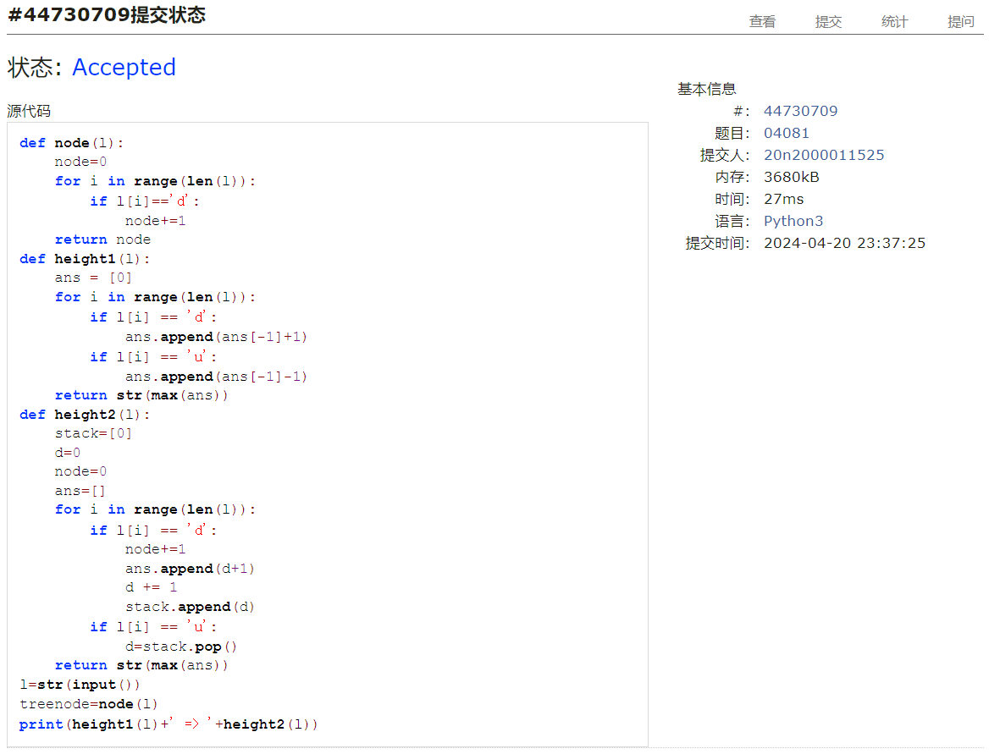
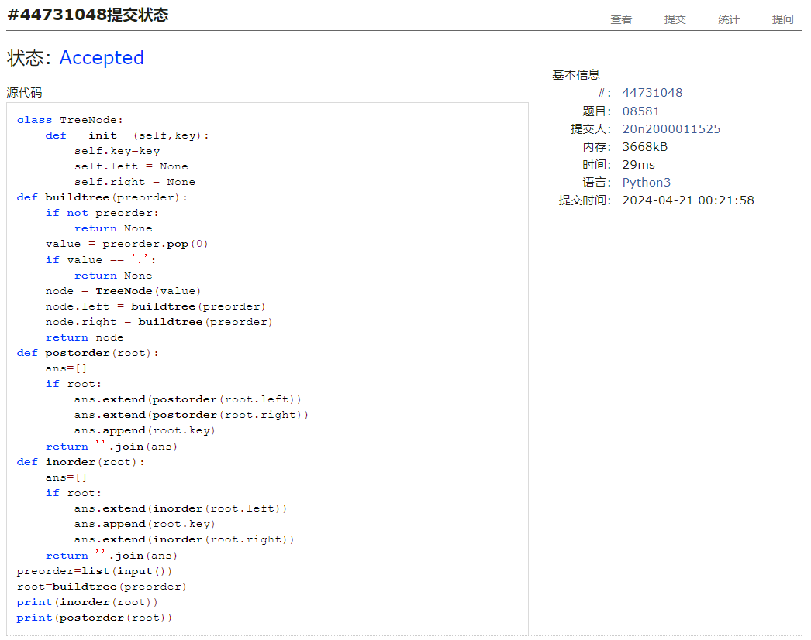
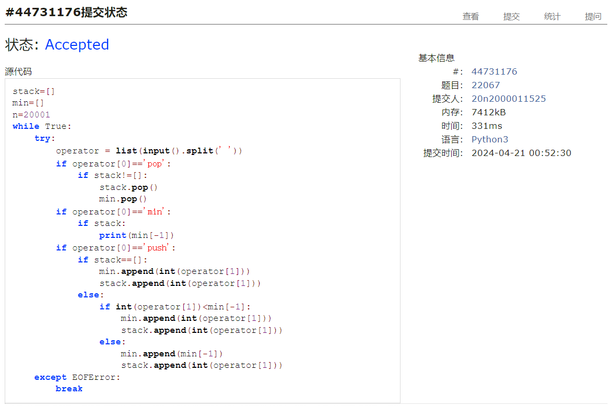
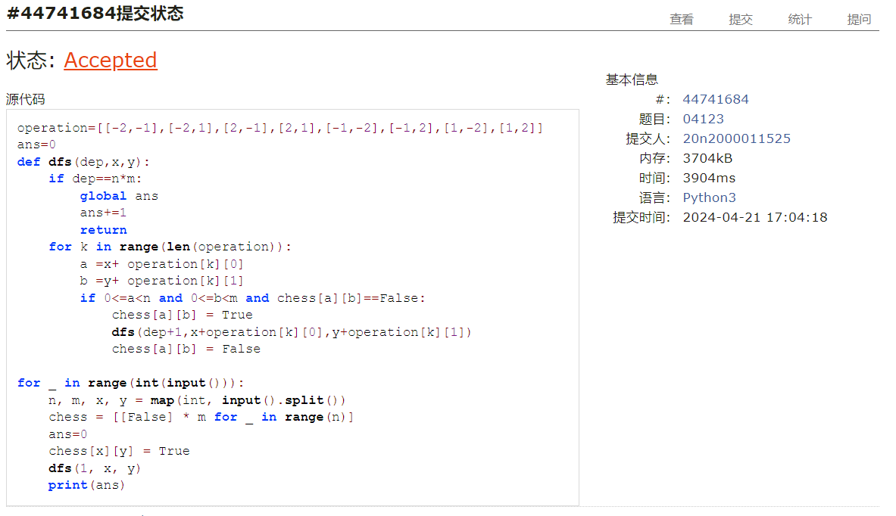

# Assignment #9: 图论：遍历，及 树算

Updated 0000 GMT+8 April, 21, 2024

2024 spring, Complied by ==何昱、物理学院==


**编程环境**

操作系统：版本	Windows 10 家庭中文版

Python编程环境：PyCharm 2022.2.1 (Professional Edition)


## 1. 题目

### 04081: 树的转换

http://cs101.openjudge.cn/dsapre/04081/


思路：发现不用建树，只需要让d和u配对即可


代码

```python
# 
def node(l):
    node=0
    for i in range(len(l)):
        if l[i]=='d':
            node+=1
    return node
def height1(l):
    ans = [0]
    for i in range(len(l)):
        if l[i] == 'd':
            ans.append(ans[-1]+1)
        if l[i] == 'u':
            ans.append(ans[-1]-1)
    return str(max(ans))
def height2(l):
    stack=[0]
    d=0
    node=0
    ans=[]
    for i in range(len(l)):
        if l[i] == 'd':
            node+=1
            ans.append(d+1)
            d += 1
            stack.append(d)
        if l[i] == 'u':
            d=stack.pop()
    return str(max(ans))
l=str(input())
treenode=node(l)
print(height1(l)+' => '+height2(l))
```


代码运行截图 ==（至少包含有"Accepted"）==



### 08581: 扩展二叉树

http://cs101.openjudge.cn/dsapre/08581/


思路：递归建树，遇到.返回即可


代码

```python
# 
class TreeNode:
    def __init__(self,key):
        self.key=key
        self.left = None
        self.right = None
def buildtree(preorder):
    if not preorder:
        return None
    value = preorder.pop(0)
    if value == '.':
        return None
    node = TreeNode(value)
    node.left = buildtree(preorder)
    node.right = buildtree(preorder)
    return node
def postorder(root):
    ans=[]
    if root:
        ans.extend(postorder(root.left))
        ans.extend(postorder(root.right))
        ans.append(root.key)
    return ''.join(ans)
def inorder(root):
    ans=[]
    if root:
        ans.extend(inorder(root.left))
        ans.append(root.key)
        ans.extend(inorder(root.right))
    return ''.join(ans)
preorder=list(input())
root=buildtree(preorder)
print(inorder(root))
print(postorder(root))
```


代码运行截图 ==（至少包含有"Accepted"）==



### 22067: 快速堆猪

http://cs101.openjudge.cn/practice/22067/


思路：栈，直接使用min会超时，维护一个记录最小值的栈即可


代码

```python
# 
stack=[]
min=[]
n=20001
while True:
    try:
        operator = list(input().split(' '))
        if operator[0]=='pop':
            if stack!=[]:
                stack.pop()
                min.pop()
        if operator[0]=='min':
            if stack:
                print(min[-1])
        if operator[0]=='push':
            if stack==[]:
                min.append(int(operator[1]))
                stack.append(int(operator[1]))
            else:
                if int(operator[1])<min[-1]:
                    min.append(int(operator[1]))
                    stack.append(int(operator[1]))
                else:
                    min.append(min[-1])
                    stack.append(int(operator[1]))
    except EOFError:
        break
```


代码运行截图 ==（AC代码截图，至少包含有"Accepted"）==



### 04123: 马走日

dfs, http://cs101.openjudge.cn/practice/04123


思路：递归


代码

```python
# 
operation=[[-2,-1],[-2,1],[2,-1],[2,1],[-1,-2],[-1,2],[1,-2],[1,2]]
ans=0
def dfs(dep,x,y):
    if dep==n*m:
        global ans
        ans+=1
        return
    for k in range(len(operation)):
        a =x+ operation[k][0]
        b =y+ operation[k][1]
        if 0<=a<n and 0<=b<m and chess[a][b]==False:
            chess[a][b] = True
            dfs(dep+1,x+operation[k][0],y+operation[k][1])
            chess[a][b] = False

for _ in range(int(input())):
    n, m, x, y = map(int, input().split())
    chess = [[False] * m for _ in range(n)]
    ans=0
    chess[x][y] = True
    dfs(1, x, y)
    print(ans)
```


代码运行截图 ==（AC代码截图，至少包含有"Accepted"）==



### 28046: 词梯

bfs, http://cs101.openjudge.cn/practice/28046/


思路：


代码

```python
# 

```


代码运行截图 ==（AC代码截图，至少包含有"Accepted"）==


### 28050: 骑士周游

dfs, http://cs101.openjudge.cn/practice/28050/


思路：


代码

```python
# 

```


代码运行截图 ==（AC代码截图，至少包含有"Accepted"）==


## 2. 学习总结和收获


