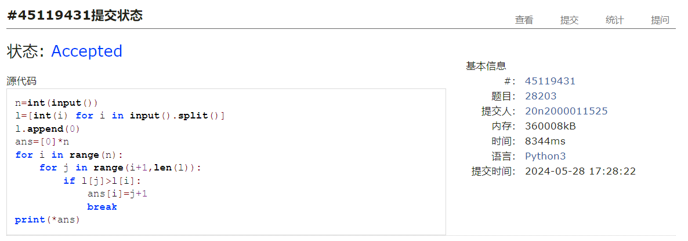
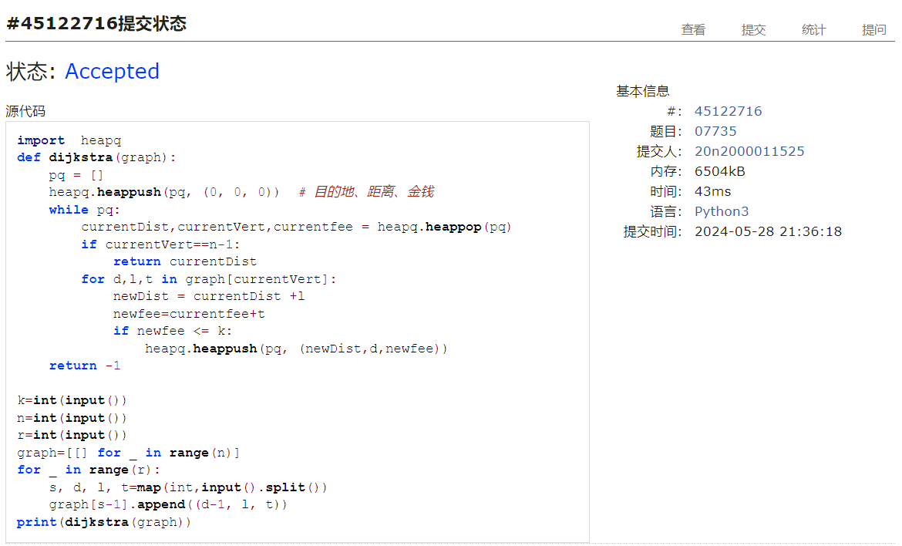

# Assignment #F: All-Killed 满分

Updated 1700 GMT+8 May, 28, 2024

2024 spring, Complied by ==何昱、物理学院==


**编程环境**

操作系统：版本	Windows 10 家庭中文版

Python编程环境：PyCharm 2022.2.1 (Professional Edition)


## 1. 题目

### 22485: 升空的焰火，从侧面看

http://cs101.openjudge.cn/practice/22485/


思路：广度优先搜索，把每层最右边的节点存下来即可


代码

```python
import copy
def bfs(treenode,root):
    rightview=[]
    queue=[root]
    while queue:
        rightview.append(queue[-1])
        queue1=[]
        for i in queue:
            for j in treenode[i]:
                if j != -1:
                    queue1.append(j)
        queue=copy.deepcopy(queue1)
    return rightview

n=int(input())
treenode={}
for i in range(n):
    leftnode,rightnode=map(int,input().split())
    treenode[i+1]=[leftnode,rightnode]
print(' '.join(str(k) for k in bfs(treenode,1)))
```


代码运行截图 ==（至少包含有"Accepted"）==


### 28203:【模板】单调栈

http://cs101.openjudge.cn/practice/28203/


思路：进行比较即可


代码

```python
n=int(input())
l=[int(i) for i in input().split()]
l.append(0)
ans=[0]*n
for i in range(n):
    for j in range(i+1,len(l)):
        if l[j]>l[i]:
            ans[i]=j+1
            break
print(*ans)
```


代码运行截图 ==（至少包含有"Accepted"）==



### 09202: 舰队、海域出击！

http://cs101.openjudge.cn/practice/09202/


思路：从⼀个节点开始，然后访问它的每⼀个邻居。如果在访问过程中，遇到了⼀个已经在当前路径中的节点，那么就存在⼀个环。可以使⽤⼀个颜⾊数组来跟踪每个节点的状态：未访问（0），正在访问（1），已访问（2）。


代码

```python
def has_cycle(n,edges):
    graph = [[] for _ in range(n)]
    for u, v in edges:
        graph[u].append(v)
    color=[0]*n

    def dfs(node):
        if color[node] == 1:
            return True
        if color[node] == 2:
            return False
        color[node] = 1
        for neighbor in graph[node]:
            if dfs(neighbor):
                return True
        color[node] = 2
        return False
    for i in range(n):
        if dfs(i):
            return 'Yes'
    return 'No'

T=int(input())
for _ in range(T):
    N,M=map(int,input().split())
    edges=[]
    for i in range(M):
        x,y=map(int,input().split())
        edges.append((x-1,y-1))
    print(has_cycle(N,edges))
```


代码运行截图 ==（AC代码截图，至少包含有"Accepted"）==


### 04135: 月度开销

http://cs101.openjudge.cn/practice/04135/


思路：


代码

```python
# 

```


代码运行截图 ==（AC代码截图，至少包含有"Accepted"）==


### 07735: 道路

http://cs101.openjudge.cn/practice/07735/


思路：dijkstra


代码

```python
import  heapq
def dijkstra(graph):
    pq = []
    heapq.heappush(pq, (0, 0, 0))  # 目的地、距离、金钱
    while pq:
        currentDist,currentVert,currentfee = heapq.heappop(pq)
        if currentVert==n-1:
            return currentDist
        for d,l,t in graph[currentVert]:
            newDist = currentDist +l
            newfee=currentfee+t
            if newfee <= k:
                heapq.heappush(pq, (newDist,d,newfee))
    return -1

k=int(input())
n=int(input())
r=int(input())
graph=[[] for _ in range(n)]
for _ in range(r):
    s, d, l, t=map(int,input().split())
    graph[s-1].append((d-1, l, t))
print(dijkstra(graph))
```


代码运行截图 ==（AC代码截图，至少包含有"Accepted"）==



### 01182: 食物链

http://cs101.openjudge.cn/practice/01182/


思路：


代码

```python
# 

```


代码运行截图 ==（AC代码截图，至少包含有"Accepted"）==


## 2. 学习总结和收获

有点难，希望期末机考的时候简单点


